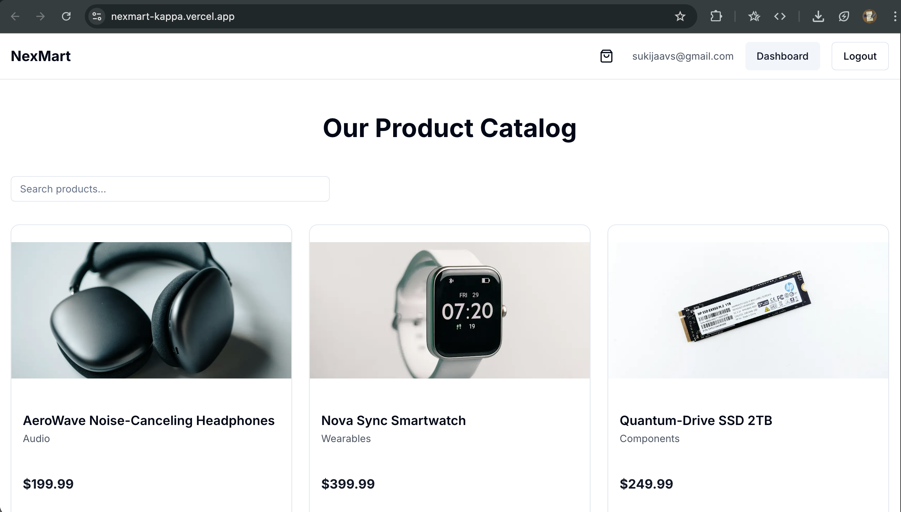
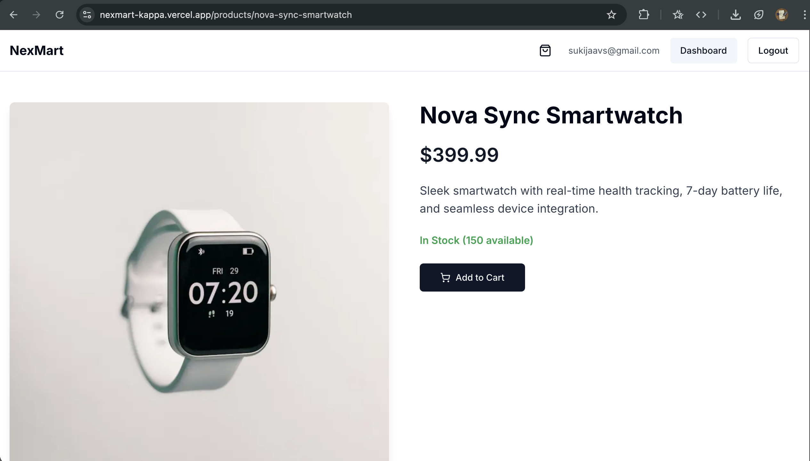
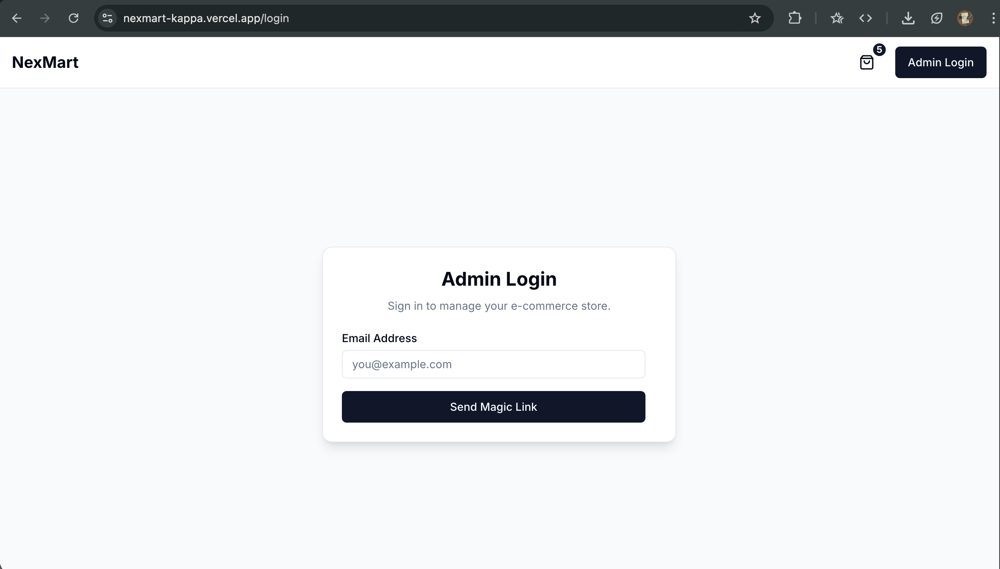
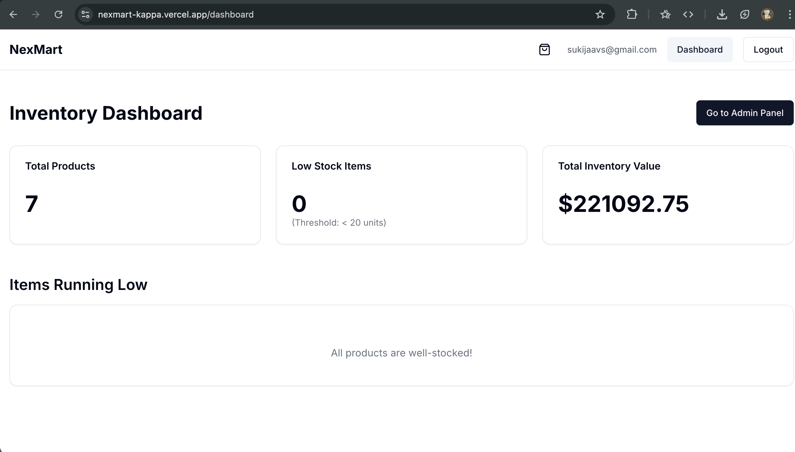
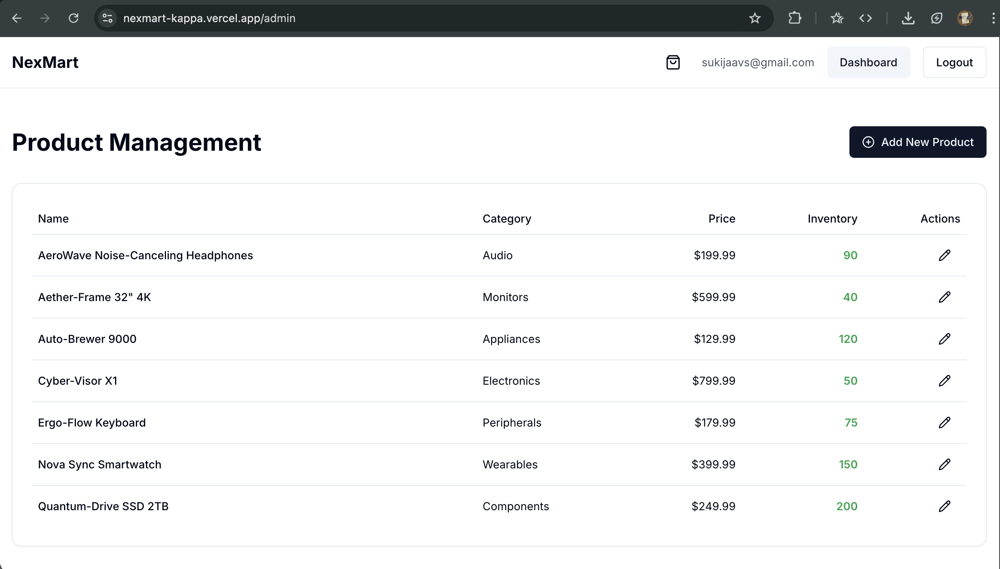
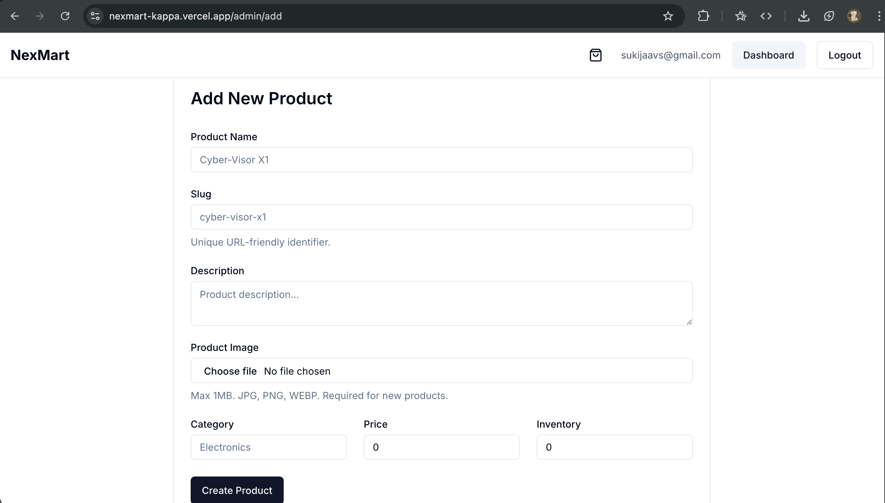
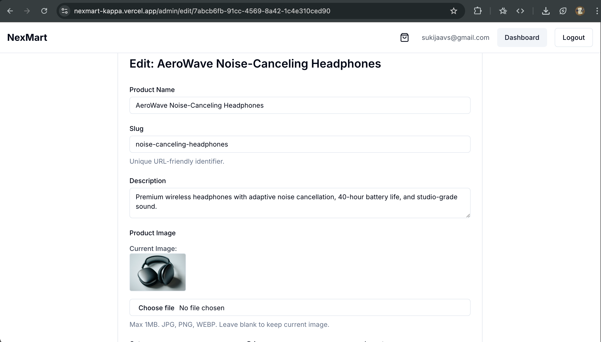
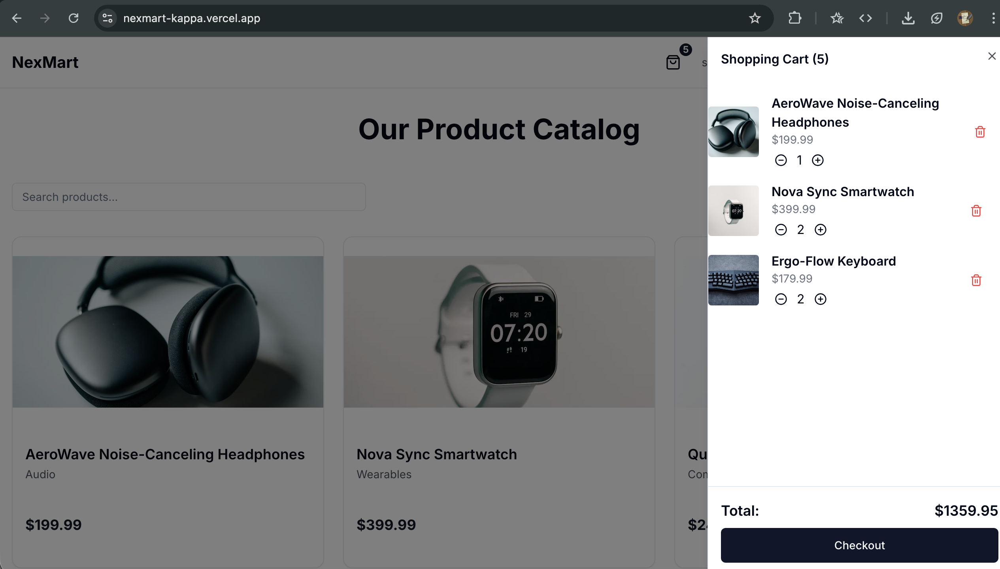

Project Report: NexMart 

Author: Sukijaa VS
Date: Wednesday, October 29, 2025
Project Goal: To build a modern e-commerce product catalog using Next.js, demonstrating various rendering strategies and incorporating advanced features for a professional portfolio piece.

1. Introduction

This report details the implementation of the NexMart e-commerce catalog application. The project was built using Next.js 14 (App Router) and TypeScript, leveraging Supabase for database, authentication, and storage. The primary goal was to demonstrate proficiency in different Next.js rendering strategies (SSG, SSR, CSR) while also incorporating modern best practices like Server Actions, On-Demand Revalidation, and a professional UI using Shadcn/ui and Tailwind CSS. Additional features like image uploads and a client-side shopping cart (Zustand) were added to showcase a broader skillset.

2. Rendering Strategy Rationale

Choosing the appropriate rendering strategy is crucial for performance, SEO, and data freshness. The following choices were made for each key section:

a) Homepage (/) - SSG (Static Site Generation)

Strategy: Default behavior of Next.js App Router Server Components without dynamic functions or force-dynamic. Data is fetched at build time.

Rationale: The homepage primarily displays a list of products that doesn't change extremely frequently for every user. SSG provides the best possible performance by serving pre-built HTML files from a CDN. This also maximizes SEO benefits as search engine crawlers receive fully rendered content immediately. Client-side search/filtering was added for interactivity without requiring server requests.

Implementation: The page (app/page.tsx) is a Server Component that fetches all products using the Supabase client during the build process.

b) Product Detail Page (/products/[slug]) - SSR (Server-Side Rendering) with On-Demand Revalidation

Strategy: Server-Side Rendering forced using export const dynamic = 'force-dynamic'. Data is fetched on the server for each request. Additionally, revalidatePath is used in Server Actions to purge the Vercel data cache when a product is updated.

Rationale: Product details (especially price and inventory) might change more frequently than the homepage list. While Incremental Static Regeneration (ISR) was the initial goal (combining static speed with periodic updates), persistent issues encountered with build tools (specifically Turbopack during development and Vercel's build environment) related to dynamic parameters made SSR a more stable choice for this project iteration. SSR ensures data is always fresh for each request, which is acceptable for product pages. Critically, On-Demand Revalidation via revalidatePath in the updateProduct Server Action provides the instant cache invalidation benefit originally sought from ISR, ensuring users see updated product info immediately after an admin saves changes. This hybrid approach still demonstrates advanced caching knowledge.

Implementation: The page (app/products/[slug]/page.tsx) is a Server Component marked with export const dynamic = 'force-dynamic'. It fetches data for a single product based on the slug parameter on each request. The updateProduct Server Action (lib/actions.ts) calls revalidatePath('/products/[slug]') after a successful database update.

c) Inventory Dashboard (/dashboard) - SSR (Server-Side Rendering)

Strategy: Server-Side Rendering forced using export const dynamic = 'force-dynamic'.

Rationale: This page is protected and displays real-time inventory statistics (total products, low stock items, total value). This data must be current on every view. SSR guarantees that the data is fetched live from the database every time an authenticated user accesses the page.

Implementation: The page (app/dashboard/page.tsx) is a Server Component marked with export const dynamic = 'force-dynamic'. It fetches product data on each request and calculates statistics server-side. Access is restricted via middleware.ts.

d) Admin Panel (/admin) - CSR (Client-Side Rendering)

Strategy: Client-Side Rendering using the 'use client' directive.

Rationale: The admin panel features an interactive data table displaying all products, intended for management tasks (linking to add/edit forms). Fetching the potentially large list of products client-side after the initial page load provides a faster perceived load time for the UI shell. The interactivity of sorting, filtering (if added later), and triggering actions benefits from running in the browser. The route is protected by middleware.

Implementation: The page (app/admin/page.tsx) uses 'use client'. It renders a loading state initially, then fetches the product list using useEffect and the client-side Supabase helper (lib/supabase/client.ts). Data is displayed using Shadcn's <Table> component.

3. Data Flow

The application utilizes several data flow patterns:

Read (Public Pages):

User requests Page (e.g., / or /products/slug).

Next.js Server Component runs.

Server Component uses Supabase Server Client (lib/supabase/server.ts) to fetch data from Supabase DB (read-only access allowed by RLS policy).

Component renders HTML, sent to the client. (Data might be cached by Vercel Data Cache for SSG/SSR pages).

Read (Admin CSR):

User requests Page (/admin).

Middleware verifies auth.

Next.js sends minimal HTML shell.

Client Component ('use client') mounts in the browser.

useEffect hook triggers.

Client Component uses Supabase Client (lib/supabase/client.ts) to fetch data from /api/products (or directly from Supabase via client helper if preferred, leveraging RLS).

Component updates state and re-renders with data.

Write/Update (Server Actions):

User interacts with Client Form Component (components/ProductForm.tsx, uses react-hook-form, zod for client validation).

User submits form.

form.handleSubmit runs client validation.

If valid, startTransition calls Server Action (dispatch from useActionState, e.g., createProduct or updateProduct in lib/actions.ts).

Server Action runs on the server.

Server Action performs Zod validation again (server-side).

If image present, Server Action uses Supabase Server Client (lib/supabase/server.ts) to upload to Supabase Storage.

Server Action uses Supabase Server Client to INSERT or UPDATE data in Supabase DB (allowed via RLS policy for authenticated users).

Server Action calls revalidatePath to invalidate Vercel Data Cache for affected pages.

Server Action returns { success: true/false, message: '...', errors: ... } state to the Client Form Component via useActionState.

Client Form Component (useEffect) reads the returned state, shows success/error toast (sonner), and redirects (useRouter) on success.

Authentication:

User enters email on /login (Client Component).

Client Component calls Supabase Client (signInWithOtp, specifies emailRedirectTo).

Supabase sends Magic Link email containing a callback URL (/auth/callback?token=...).

User clicks link.

Browser hits /auth/callback (Route Handler).

Route Handler uses Supabase Server Client (exchangeCodeForSession) to verify token and set auth cookies.

Route Handler redirects user to / (Homepage).

On subsequent requests to protected routes (/dashboard, /admin):

middleware.ts runs first.

It uses Supabase Server Client (getUser) to read auth cookies.

If no user, redirects to /login.

If user exists, allows request to proceed.

4. Challenges Faced & Solutions

Developing this application involved several significant challenges, primarily related to configuring modern Next.js features, dependencies, and deployment environments:

Turbopack/Build Tool Inconsistencies (params Promise Bug):

Challenge: During local development with Turbopack (Next.js 16 initially, persisted slightly in v14), dynamic route parameters (params.slug, params.id) were intermittently passed as Promise objects instead of plain objects to Server Components (ProductPage, EditProductPage) and API routes, causing crashes or 404 errors.

Solution: Implemented workarounds using await params locally. For deployment stability, the Product Detail Page was switched from ISR to SSR (force-dynamic). The most stubborn build errors on Vercel required downgrading to Next.js 14 / React 18, explicitly forcing Webpack (turbopack: false in config, eventually removed), or using alternative methods like extracting slugs from the URL or adding @ts-ignore comments in API routes during debugging phases. The final stable solution involved using the standard non-Promise signature with Next.js 14 and Webpack/Vercel's default build.

Vercel Build Environment Discrepancies:

Challenge: The Vercel build environment repeatedly failed with errors (incorrect API route type signatures, Tailwind CSS configuration errors like @import vs @tailwind or missing modules) that did not occur locally, even after force pushes and clearing Vercel build caches.

Solution: This required meticulous debugging:

Downgrading from experimental Next.js 16/React 19 to stable Next.js 14/React 18.

Ensuring exact alignment of Tailwind/PostCSS config files (tailwind.config.ts, postcss.config.mjs, globals.css) with standard v3 practices.

Aggressively cleaning local caches (.next, node_modules, npm cache).

Explicitly setting the Node.js version ("engines": { "node": "20.x" } in package.json).

Crucially, deploying to a completely new Vercel project to bypass potential persistent caching/configuration issues on the original Vercel project instance.

Server Action State Management & Client Validation:

Challenge: Integrating Server Actions with react-hook-form required careful handling to ensure client-side validation (especially for file sizes) prevented form submission before the Server Action was called, and to correctly display server-returned errors or success messages. The correct hook (useActionState vs useFormState) also depended on the React version.

Solution: Utilized form.handleSubmit to trigger client validation first. Inside its callback, useTransition was used to wrap the manual dispatch call (obtained from useFormState after downgrading to React 18), providing correct pending states and preventing submission on client errors. Server-returned errors (state.errors) are mapped back to the form using form.setError in a useEffect.

Configuration File Syntax/Handling:

Challenge: Inconsistencies arose with config file naming (next.config.ts vs .mjs) and module syntax (import vs require) after dependency changes and downgrades, leading to build failures.

Solution: Standardized on next.config.mjs and postcss.config.mjs using export default, while keeping tailwind.config.ts using require for plugins, which proved stable after downgrading to Next.js 14.

These challenges highlighted the importance of using stable framework versions for deployment, meticulously managing configuration files, and understanding the nuances of client-server interactions with Server Actions and build tool behavior.

5. Screenshots

(Please insert your screenshots below each heading)

a) Homepage (/)

b) Product Detail Page (/products/[slug])

c) Login Page (/login)

d) Inventory Dashboard (/dashboard)

e) Admin Panel (/admin)

f) Add Product Form (/admin/add)

g) Edit Product Form (/admin/edit/[id])

h) Cart Sheet (Open)

6. Conclusion

The NexMart / QuantumFlow Catalog project successfully demonstrates the implementation of various Next.js rendering strategies within a single application, integrated with a Supabase backend. Beyond meeting the core requirements, the project incorporates modern features like Server Actions, On-Demand Revalidation, authentication, image storage, and a client-side cart, built with TypeScript and a professional UI library. The extensive debugging process, particularly concerning build environment discrepancies, provided valuable experience in troubleshooting modern web development workflows. The final deployed application serves as a strong portfolio piece showcasing proficiency in current full-stack development practices using the Next.js ecosystem.

Appendix: Supabase Schema (supabase_schema.sql)

-- Create the 'products' table
CREATE TABLE products (
  id uuid DEFAULT gen_random_uuid() PRIMARY KEY,
  created_at timestamp with time zone DEFAULT timezone('utc'::text, now()) NOT NULL,

  name text NOT NULL,
  slug text NOT NULL UNIQUE,
  description text,
  price numeric(10, 2) NOT NULL DEFAULT 0.00,
  category text,
  inventory integer NOT NULL DEFAULT 0,

  image_url text, -- Stores the public URL from Supabase Storage

  "lastUpdated" timestamp with time zone DEFAULT timezone('utc'::text, now()) NOT NULL
);

-- Secure the table: Enable Row Level Security (RLS)
ALTER TABLE products ENABLE ROW LEVEL SECURITY;

-- Policy: Allow public read access
CREATE POLICY "Allow public read access to products"
ON products
FOR SELECT
USING (true);

-- Policy: Allow full access for authenticated users (admins)
CREATE POLICY "Allow full access for authenticated users"
ON products
FOR ALL
USING (auth.role() = 'authenticated')
WITH CHECK (auth.role() = 'authenticated');

-- Note: Storage Bucket Policies (INSERT, UPDATE, DELETE for 'product-images' bucket
-- allowing 'authenticated' users) must be created via the Supabase Dashboard UI.
-- Example Policy Definition for Storage:
-- (bucket_id = 'product-images' AND auth.role() = 'authenticated')
